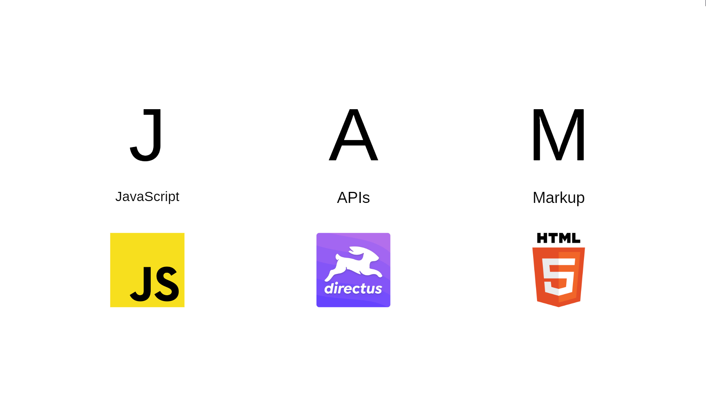

# Jamstack Website Project with HTML, CSS, JavaScript, and Strapi



## Project Overview
This project is a **Jamstack** website built with **HTML**, **CSS**, **JavaScript**, and powered by **Strapi**, a headless CMS. Jamstack architecture provides faster performance, better security, and improved scalability by decoupling the frontend from the backend. With Strapi, we manage content dynamically, making it easy to update and deploy without rebuilding the entire site.

## Features
- **Jamstack architecture:** Modern web development with static content generation for faster page load times.
Headless CMS: Strapi CMS for content management, enabling easy updates without code changes.
- **Responsive design:** Built using CSS for mobile-first design, ensuring a seamless user experience across devices.
- **Dynamic content:** JavaScript to fetch and display data from the Strapi backend via REST API or GraphQL.
- **Scalability:** Frontend and backend are decoupled, allowing independent scaling of each component.

## Technologies
- **Frontend:**
  - **HTML5:** Structure and semantic markup of web pages.
  - **CSS3:** Styling using flexbox, grid, and responsive design principles.
  - **JavaScript (ES6+):** Handling interactivity and dynamic content fetching.
- **Backend:**
  - **Strapi:** A customizable, open-source headless CMS used to manage content dynamically.
  - **API:** Content is fetched using Strapi's RESTful API or GraphQL.
- **Deployment:** The website can be deployed on platforms such as **Netlify**, **Vercel**, or **GitHub Pages**.

## Folder Structure
The folder structure for this Jamstack project follows best practices for maintainability and scalability.

```bash
/project-root
│
├── /assets                 # Contains images, fonts, and other static assets.
│   ├── /images             # Website images.
│   ├── /fonts              # Custom fonts if applicable.
│
├── /css                    # CSS files for styling.
│   ├── main.css            # Global styles.
│   └── /partials           # Modular CSS files (optional).
│
├── /js                     # JavaScript files for interactivity.
│   ├── main.js             # Main JavaScript file.
│   └── /services           # Service files for API calls and utilities.
│       ├── strapiAPI.js    # Handles fetching data from Strapi API.
│
├── /vendor                 # External libraries and frameworks (if any).
│   ├── /css                # Vendor CSS (e.g., Bootstrap).
│   └── /js                 # Vendor JS (e.g., Swiper.js).
│
├── /pages                  # HTML files for individual pages.
│   ├── index.html          # Homepage.
│   ├── about.html          # About page.
│   └── contact.html        # Contact page.
│
├── /partials               # Reusable HTML components (e.g., header, footer).
│   ├── header.html
│   └── footer.html
│
├── /api                    # API documentation or helper files.
│   └── strapiConfig.js     # Configuration for Strapi API access.
│
└── README.md               # Documentation for the project.
```

## Installation
### Prerequisites
### Steps

## Usage
### Fetching Data from Strapi
The JavaScript file `strapiAPI.js` handles all API requests to Strapi. It fetches content dynamically from the CMS and renders it on the frontend.

Example of fetching articles from Strapi's REST API:

```javascript
const fetchArticles = async () => {
  try {
    const response = await fetch('http://localhost:1337/api/articles');
    const data = await response.json();
    return data;
  } catch (error) {
    console.error('Error fetching articles:', error);
  }
};
```

### Customizing Content
1. Log in to your **Strapi admin panel**.
2. Add or modify content types (e.g., Articles, Blog Posts).
3. The changes will be reflected dynamically on the frontend.

### Styling
Modify the CSS files located in the `/css` folder to change the look and feel of the website. Use `/partials`for modular stylesheets, and consider splitting CSS for specific components or sections of your site.

## Deployment
The frontend of this Jamstack project can be deployed on static hosting platforms like **Netlify** or **Vercel**. Since the website fetches data dynamically from Strapi via an API, make sure to:

1. **Deploy Strapi** on a hosting service (e.g., Heroku, DigitalOcean).
2. **Deploy the frontend:**
  - On **Netlify**: Push your code to GitHub, and connect your repository to Netlify. The site will automatically deploy.
  - On **Vercel**: Vercel also works with GitHub repositories to automatically build and deploy your frontend.